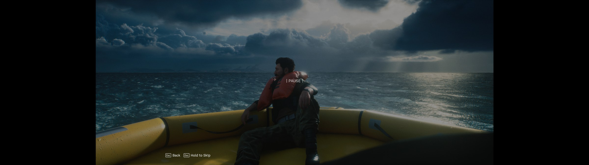

# ACE COMBAT 8: Wings of Theve (Ultrawide & FOV Fix)

A UE4SS Lua mod that removes the black side bars (pillarboxing) in ACE COMBAT 8 cutscenes and menus on ultrawide and super-ultrawide screens (anything wider than 21:9, such as 32:9), and adds an adjustable flight FOV for the third-person, cockpit and HUD-only views.

Windows only. Single-player / offline only (see [Anti-cheat](#anti-cheat)).

| Before (stock, 32:9) | After (this fix, 32:9) |
|---|---|
|  |  |

## Features
- **Removes pillarbox** on real-time cutscenes, menus and the hangar.
- **Hor+ framing:** the vertical framing the game was authored with is kept, and you see more on the sides.
- **Adjustable flight FOV**, separately for third-person, cockpit and HUD-only views. Changes show instantly in flight; PageUp/PageDown tune the current view and are saved automatically.
- **Stable cutscene fix:** it runs no per-frame code and keeps no references to game objects. See [How it works](#how-it-works).
- **One-key A/B toggle** (F8) and a log file for troubleshooting.

## Requirements
- ACE COMBAT 8: Wings of Theve (Steam). The game runs on Unreal Engine 5.4.
- [UE4SS](https://github.com/UE4SS-RE/RE-UE4SS/releases) with UE 5.4 support, installed in `ACE COMBAT 8\Game\Binaries\Win64\`. This fix was developed and tested on UE4SS **v3.0.1** (beta build).

## Install
### Release
1. Install UE4SS into `ACE COMBAT 8\Game\Binaries\Win64\` (you should end up with `Win64\ue4ss\UE4SS.dll`).
2. Download the latest zip from [Releases](https://github.com/Ferosnow95/AceCombat8Fix/releases).
3. Extract it into `ACE COMBAT 8\Game\Binaries\Win64\`. You should get `Win64\ue4ss\Mods\AC8CutsceneUW\`.
4. Launch the game. `enabled.txt` is included, so UE4SS loads the mod automatically; `mods.txt` doesn't need editing.

### From source
Copy `src/AC8CutsceneUW` into `ACE COMBAT 8\Game\Binaries\Win64\ue4ss\Mods\`.

## Controls
| Key | Action |
|---|---|
| PageUp / PageDown | Flight FOV +/- 2° (16:9 terms) for the view you're in: third-person, cockpit or HUD-only. Takes effect immediately and is saved. |
| Home | Give the current view's FOV back to the game (its own dynamic FOV) |
| F8 | Toggle the whole fix on/off (restores the game's original cap and FOV) |
| F7 | Write a diagnostic snapshot to the log |

## Configuration
Adjust settings in `ACE COMBAT 8\Game\Binaries\Win64\ue4ss\Mods\AC8CutsceneUW\Scripts\config.lua`.

| Setting | Default | What it does |
|---|---|---|
| `AspectRatioMaxValue` | `0` | `0` = lift AC8's aspect cap to your screen's aspect ratio (auto-detected). Or a fixed value, e.g. `3.5656`. |
| `ForceAspectRatio` | `0` | `0` = auto-detect the screen shape. Set it if detection is wrong: `3.5556` for 32:9, `2.3889` for 3440×1440. |
| `FlightFOV` | `true` | Master switch for the flight FOV part. |
| `ThirdPersonFOV` | `80` | Third-person FOV, in 16:9-equivalent degrees (the game's own is 61.9). `0` = leave it to the game. |
| `CockpitFOV` | `90` | Cockpit FOV, same units (game's own: 73.7). |
| `FirstPersonFOV` | `90` | HUD-only view FOV, same units (game's own: 73.7). |
| `FOVStep` | `2` | Degrees per PageUp/PageDown press. |
| `IgnoreOtherFOVMod` | `false` | The fix switches its FOV off if the AC8CockpitFOV mod is enabled (both would set the FOV every frame). `true` = run anyway. |
| `WriteLogFile` | `true` | Write `AC8CutsceneUW.log` next to the mod. |

FOV values tuned in game are saved to `AC8CutsceneUW_flightfov.txt` and override the config. Delete that file to go back to the config values.

The FOV numbers are **16:9-equivalent**, and the mod widens them for your screen automatically. On 32:9, 80° is about 118° wide, 90° is about 127° wide.

ACE COMBAT 8 ships with Easy Anti-Cheat. UE4SS mods only load when EAC isn't running. **Use this fix for offline single-player only, and never take a modded game online or into co-op.**

## Known issues
- **A locked FOV replaces the game's dynamic FOV** (speed and afterburner changes) in the views where you set one. Use `0` or Home to give it back.
- The flight FOV is for offline play only: it does nothing when the world has a net driver.
- Pre-rendered videos (the online-mode MP4s) can't be widened.
- Developed and tested on one PC (32:9, 5120×1440). Reports from 21:9 and 48:9 (triple-screen) setups are welcome.

## Troubleshooting
The mod writes `AC8CutsceneUW.log` next to itself (the previous session is kept as `AC8CutsceneUW.prev.log`). Press F7 in the broken scene and attach the log to an issue. The log also records each FOV change and which flight view was detected.

## License
Distributed under the MIT License. See [LICENSE](LICENSE).

## External tools and credits
- [RE-UE4SS](https://github.com/UE4SS-RE/RE-UE4SS) — the Lua scripting runtime this mod runs on.
- Works alongside the [AC8 Ultrawide UI Fix](https://www.nexusmods.com/acecombat8wingsoftheve/mods/12) (HUD layout), which is a separate mod.
